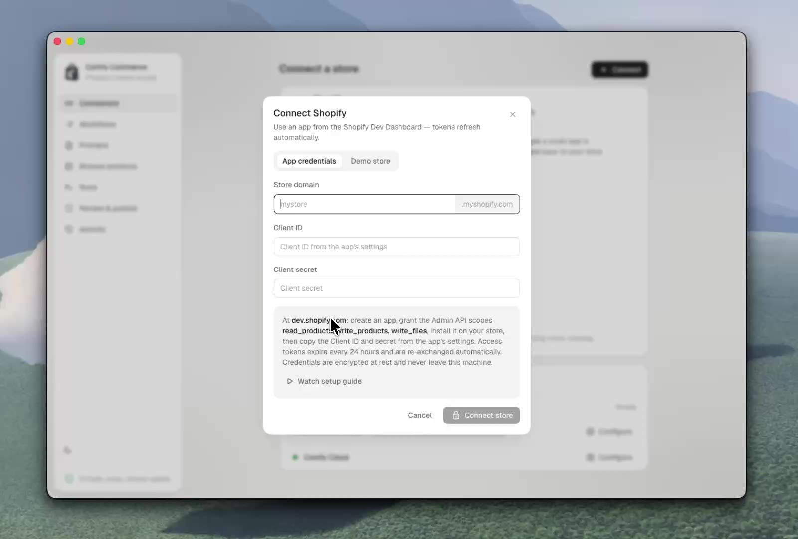

# Connecting a Shopify store

Setup takes about two minutes: create your own Shopify app once, paste two values into
Comfy Commerce. The video walks through the whole thing — it also plays inside the app's
**Connect** dialog.

<div align="center">
<a href="../web/public/setup/shopify-connect.mp4"></a>
</div>

## The five steps

1. <https://dev.shopify.com> → **Apps** → **Create app**.
2. Set the Admin API access scopes to `read_products,write_products,write_files`.
3. **Install** the app on your store.
4. Copy the **Client ID** and **Client secret**.
5. In Comfy Commerce: **Connect → App credentials** → enter your shop domain, paste both values.

That's it. The broker validates the credentials against Shopify, encrypts them at rest, and
confirms the store is connected. Creating the app (steps 1–4) needs *your* Shopify login — that's
the one step no agent or tool can do for you.

**Why your own app?** Comfy Commerce is bring-your-own-app: no shared, centrally-hosted app, no
one else's infrastructure, credentials only ever in your local broker. It requests **product,
media, and file** scopes only — never customer or order data. The canonical app definition is
[`shopify.app.toml`](../shopify.app.toml).

**Store in a different organization?** App credentials require the app and store to share a
Shopify org (the normal case). For a cross-org store, use the OAuth path: add the redirect URL
`http://localhost:4000/api/connect/shopify/callback` to the app, then connect with
**Connect → OAuth** instead.

<details>
<summary><b>Let your coding agent do it</b></summary>

Hand the agent this runbook. It does everything except the browser step.

1. Ensure the broker is reachable (`GET /api/stores`).
2. Walk the user through steps 1–4 above and ask for three values: shop domain, Client ID,
   Client secret. (The secret is sensitive — it goes only to the user's local broker, nowhere else.)
3. Connect via the same endpoint the **App credentials** button uses:

   ```bash
   curl -X POST http://localhost:4000/api/connect/shopify/credentials \
     -H 'content-type: application/json' \
     -d '{"shop":"<shop>.myshopify.com","clientId":"<client-id>","clientSecret":"<client-secret>"}'
   ```

   Add `-H 'authorization: Bearer <BROKER_API_TOKEN>'` if the broker was started with a token.
4. A `200` means connected. Verify with `GET /api/stores`.

</details>

<details>
<summary><b>Shopify CLI (optional app-creation accelerator)</b></summary>

```bash
shopify app config link     # links/creates an app from shopify.app.toml, fills in client_id
shopify app deploy          # pushes the scopes/config to Shopify
shopify app env show        # prints the Client ID and secret
```

Paste the printed values into **Connect → App credentials**. You still install the app on your
store from the Dashboard, and the CLI needs its own interactive login — so this accelerates app
creation, it doesn't remove the human step.

</details>

<details>
<summary><b><code>shopify.app.toml</code> reference</b></summary>

| Field | Meaning |
|---|---|
| `client_id` | Public app identifier — safe to commit. The **secret is never stored here**. |
| `application_url` | The broker's URL (`http://localhost:4000` by default). Keep in sync with `APP_URL`. |
| `embedded` | `false` — a standalone local app, not an embedded admin app. |
| `[access_scopes].scopes` | `read_products,write_products,write_files` — product media only. |
| `[auth].redirect_urls` | Used only by the OAuth path; ignored by App credentials. |
| `[webhooks].api_version` | Admin API version (`2026-01`). Shopify supports each version ~12 months. |

</details>

## Troubleshooting

- **No broker reachable** — start the app (`pnpm dev` / `pnpm start`, or the desktop build).
- **401 from the connect call** — the broker has `BROKER_API_TOKEN` set; send the bearer token.
- **Shopify rejected the credentials** — usually the app isn't installed on that store, the scopes
  don't match, or the app and store are in different orgs (use OAuth for cross-org). The error
  includes Shopify's exact message.
- **Wrong store/scopes after connecting** — reconnect from **Connect → App credentials**; it
  refreshes scopes.
